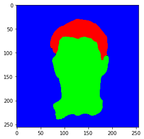
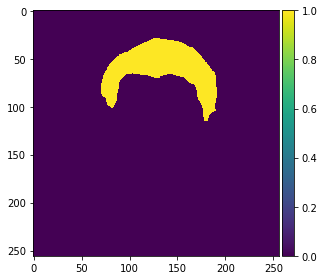

# private-repos
<h2>These Projects are set in Private Repositories either because they have sensitive data or are more related to School</h2>

<h1>Sol_Infinium</h1>
<b>Technology: </b><i>Unity,MonoDevelop,VisualStudios,Audacity,Gimp</i>

A 2D RPG sidescroller game developed in Unity. Features include Art(Background,Foreground,Character,Enemies,etc.), Scripts(Movement,Ai,Interactions,Weapons,Health), Audio and scenes.

<h1>Carnivorous-Website</h1>
Website built for personal buisiness(Ecommerce) selling Carnivorous plants.

<b>Technologies: </b><i>VSCode,React.js,SCSS,Node.js,Express.js,Stripe.js,Redux,built-in React testing,Database Undetermined</i>

<h3>No link/Domain avialable yet</h3>

<h1>Excel-Macros</h1>
<b>Technology: </b><i>Excel,Macros,Visual Basic Scripts</i>
These files are excel sheets that I used and made when helping the Industrial Engineer while working at UPS.

<h1>School Courses/Assignments</h1>
<ul>
  <li>Assembly</li>
  <li>Intro To Prog</li>
  <li>Design/Analysis</li>
  <li>HS Java</li>
  <li>C++</li>
  <li>ML (Example: Hair Segmentation)</li>
  
  
  
  
</ul>
